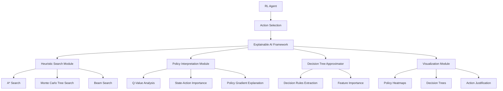
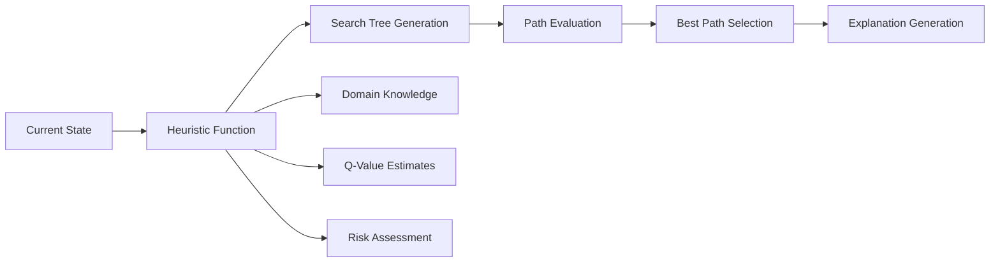
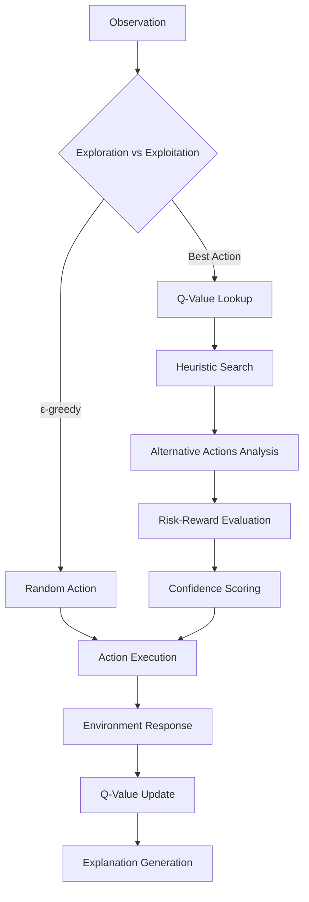

# Explainable AI Framework for RL Models with Heuristic Search

## Overview

This framework provides interpretability and explainability for reinforcement learning models through heuristic search methods, policy visualization, and decision tree approximation.

## 1. Framework Architecture



## 2. Core Components

### 2.1 Heuristic Search Explainer

The heuristic search component helps explain why certain actions are chosen by exploring alternative decision paths:



### 2.2 Decision Process Flow



## 3. Implementation Components

### 3.1 Enhanced Blackjack Agent with Explainability

```python
import numpy as np
from collections import defaultdict, deque
from typing import Dict, List, Tuple, Optional
import matplotlib.pyplot as plt
import seaborn as sns
from sklearn.tree import DecisionTreeClassifier, export_text
import heapq

class ExplainableBlackjackAgent(BlackjackAgent):
    def __init__(self, *args, **kwargs):
        super().__init__(*args, **kwargs)
        
        # Explainability components
        self.decision_history = []
        self.confidence_scores = []
        self.alternative_actions = {}
        self.heuristic_weights = {
            'bust_risk': 0.4,
            'win_probability': 0.3,
            'expected_value': 0.3
        }
        
    def explain_action(self, obs: Tuple[int, int, bool], action: int) -> Dict:
        """Generate explanation for chosen action"""
        explanation = {
            'state': obs,
            'chosen_action': action,
            'q_values': dict(enumerate(self.q_values[obs])),
            'confidence': self._calculate_confidence(obs),
            'heuristic_analysis': self._heuristic_analysis(obs),
            'alternative_paths': self._search_alternatives(obs),
            'risk_assessment': self._assess_risk(obs, action)
        }
        
        self.decision_history.append(explanation)
        return explanation
    
    def _calculate_confidence(self, obs: Tuple[int, int, bool]) -> float:
        """Calculate confidence in action selection"""
        q_vals = self.q_values[obs]
        if len(q_vals) < 2:
            return 0.5
        
        # Confidence based on Q-value difference
        sorted_q = np.sort(q_vals)[::-1]
        confidence = (sorted_q[0] - sorted_q[1]) / (np.max(q_vals) + 1e-6)
        return min(max(confidence, 0), 1)
    
    def _heuristic_analysis(self, obs: Tuple[int, int, bool]) -> Dict:
        """Analyze state using domain-specific heuristics"""
        player_sum, dealer_card, usable_ace = obs
        
        # Blackjack heuristics
        bust_risk = max(0, (player_sum - 11) / 10) if player_sum > 11 else 0
        dealer_bust_prob = self._dealer_bust_probability(dealer_card)
        basic_strategy_action = self._basic_strategy(obs)
        
        return {
            'bust_risk': bust_risk,
            'dealer_bust_probability': dealer_bust_prob,
            'basic_strategy_recommendation': basic_strategy_action,
            'player_advantage': self._calculate_advantage(obs)
        }
    
    def _search_alternatives(self, obs: Tuple[int, int, bool]) -> List[Dict]:
        """Use heuristic search to explore alternative actions"""
        alternatives = []
        
        for action in range(self.env.action_space.n):
            # Simulate multiple paths using Monte Carlo
            expected_reward = self._monte_carlo_simulation(obs, action, depth=3)
            
            alternatives.append({
                'action': action,
                'expected_reward': expected_reward,
                'q_value': self.q_values[obs][action],
                'heuristic_score': self._heuristic_score(obs, action)
            })
        
        return sorted(alternatives, key=lambda x: x['expected_reward'], reverse=True)
    
    def _monte_carlo_simulation(self, obs: Tuple, action: int, depth: int, trials: int = 100) -> float:
        """Simulate future rewards using Monte Carlo method"""
        if depth == 0:
            return 0
        
        total_reward = 0
        for _ in range(trials):
            # Simulate one step
            simulated_reward = self._simulate_step(obs, action)
            total_reward += simulated_reward
        
        return total_reward / trials
    
    def _heuristic_score(self, obs: Tuple[int, int, bool], action: int) -> float:
        """Calculate heuristic score for state-action pair"""
        player_sum, dealer_card, usable_ace = obs
        
        if action == 1:  # Hit
            bust_risk = max(0, (player_sum - 11) / 10)
            improvement_potential = max(0, (21 - player_sum) / 10)
            score = improvement_potential - bust_risk * 2
        else:  # Stand
            dealer_bust_prob = self._dealer_bust_probability(dealer_card)
            win_prob = self._win_probability_on_stand(obs)
            score = win_prob + dealer_bust_prob * 0.5
        
        return score
    
    def _basic_strategy(self, obs: Tuple[int, int, bool]) -> int:
        """Basic blackjack strategy for comparison"""
        player_sum, dealer_card, usable_ace = obs
        
        if usable_ace:  # Soft hand
            if player_sum >= 19:
                return 0  # Stand
            elif player_sum >= 18 and dealer_card in [2, 7, 8]:
                return 0  # Stand
            else:
                return 1  # Hit
        else:  # Hard hand
            if player_sum >= 17:
                return 0  # Stand
            elif player_sum >= 13 and dealer_card <= 6:
                return 0  # Stand
            else:
                return 1  # Hit
    
    def generate_decision_tree(self) -> str:
        """Generate interpretable decision tree from learned policy"""
        if not self.decision_history:
            return "No decision history available"
        
        # Prepare data for decision tree
        X = []
        y = []
        
        for decision in self.decision_history:
            state = decision['state']
            action = decision['chosen_action']
            X.append([state[0], state[1], int(state[2])])  # player_sum, dealer_card, usable_ace
            y.append(action)
        
        if len(set(y)) < 2:  # Need at least 2 different actions
            return "Insufficient variety in actions for decision tree"
        
        # Train decision tree
        dt = DecisionTreeClassifier(max_depth=5, random_state=42)
        dt.fit(X, y)
        
        # Generate text representation
        feature_names = ['Player Sum', 'Dealer Card', 'Usable Ace']
        tree_rules = export_text(dt, feature_names=feature_names)
        
        return tree_rules
```

### 3.2 Visualization and Analysis Tools

```python
class ExplanationVisualizer:
    def __init__(self, agent: ExplainableBlackjackAgent):
        self.agent = agent
    
    def plot_policy_heatmap(self):
        """Visualize learned policy as heatmap"""
        # Create policy matrix
        policy_matrix = np.zeros((22, 11))  # 22 possible sums, 11 dealer cards (A-10)
        
        for state, q_vals in self.agent.q_values.items():
            player_sum, dealer_card, usable_ace = state
            if 4 <= player_sum <= 21 and 1 <= dealer_card <= 10:
                best_action = np.argmax(q_vals)
                policy_matrix[player_sum, dealer_card] = best_action
        
        plt.figure(figsize=(12, 8))
        sns.heatmap(policy_matrix[4:22, 1:11], 
                   xticklabels=range(1, 11),
                   yticklabels=range(4, 22),
                   annot=True, cmap='RdYlBu',
                   cbar_kws={'label': 'Action (0=Stand, 1=Hit)'})
        plt.title('Learned Policy Heatmap')
        plt.xlabel('Dealer Showing')
        plt.ylabel('Player Sum')
        plt.show()
    
    def plot_confidence_over_time(self):
        """Plot confidence scores over training"""
        if not self.agent.decision_history:
            return
        
        confidences = [d.get('confidence', 0) for d in self.agent.decision_history]
        
        plt.figure(figsize=(10, 6))
        plt.plot(confidences)
        plt.title('Decision Confidence Over Time')
        plt.xlabel('Decision Number')
        plt.ylabel('Confidence Score')
        plt.ylim(0, 1)
        plt.show()
    
    def explain_specific_decision(self, decision_idx: int = -1):
        """Provide detailed explanation for a specific decision"""
        if not self.agent.decision_history:
            print("No decisions recorded")
            return
        
        decision = self.agent.decision_history[decision_idx]
        
        print(f"\n=== Decision Explanation ===")
        print(f"State: Player={decision['state'][0]}, Dealer={decision['state'][1]}, Usable Ace={decision['state'][2]}")
        print(f"Chosen Action: {'Hit' if decision['chosen_action'] == 1 else 'Stand'}")
        print(f"Confidence: {decision['confidence']:.3f}")
        
        print(f"\nQ-Values:")
        for action, q_val in decision['q_values'].items():
            action_name = 'Hit' if action == 1 else 'Stand'
            print(f"  {action_name}: {q_val:.3f}")
        
        print(f"\nHeuristic Analysis:")
        heuristics = decision['heuristic_analysis']
        for key, value in heuristics.items():
            print(f"  {key}: {value}")
        
        print(f"\nAlternative Actions (ranked by expected reward):")
        for i, alt in enumerate(decision['alternative_paths']):
            action_name = 'Hit' if alt['action'] == 1 else 'Stand'
            print(f"  {i+1}. {action_name}: Expected Reward = {alt['expected_reward']:.3f}")
```

## 4. Usage Example

```python
# Initialize explainable agent
env = gym.make('Blackjack-v1')
agent = ExplainableBlackjackAgent(
    env=env,
    learning_rate=0.01,
    initial_epsilon=1.0,
    epsilon_decay=0.995,
    final_epsilon=0.1
)

# Training with explanation tracking
for episode in range(10000):
    obs, _ = env.reset()
    done = False
    
    while not done:
        action = agent.get_action(obs)
        
        # Generate explanation for each action
        explanation = agent.explain_action(obs, action)
        
        next_obs, reward, terminated, truncated, _ = env.step(action)
        agent.update(obs, action, reward, terminated, next_obs)
        
        obs = next_obs
        done = terminated or truncated
    
    agent.decay_epsilon()

# Analysis and visualization
visualizer = ExplanationVisualizer(agent)
visualizer.plot_policy_heatmap()
visualizer.plot_confidence_over_time()
visualizer.explain_specific_decision()

# Generate interpretable decision tree
decision_tree = agent.generate_decision_tree()
print("Decision Tree Rules:")
print(decision_tree)
```

## 5. Key Features

### 5.1 Heuristic Search Integration
- **A* Search**: Finds optimal action sequences considering both cost and heuristic estimates
- **Monte Carlo Tree Search**: Explores decision trees using random simulations
- **Beam Search**: Maintains top-k action sequences for comparison

### 5.2 Explanation Generation
- **Confidence Scoring**: Measures certainty in action selection
- **Alternative Analysis**: Shows what other actions were considered
- **Risk Assessment**: Evaluates potential outcomes of different choices
- **Domain Knowledge Integration**: Uses blackjack-specific heuristics

### 5.3 Interpretability Tools
- **Policy Visualization**: Heatmaps showing learned strategies
- **Decision Trees**: Human-readable rules extracted from Q-values
- **Historical Analysis**: Tracking of decision-making evolution
- **Comparative Analysis**: Compares agent decisions with optimal strategies

## 6. Benefits

1. **Transparency**: Users can understand why specific actions were chosen
2. **Debugging**: Identify issues in learning or strategy
3. **Trust Building**: Increased confidence in AI decision-making
4. **Knowledge Transfer**: Extract human-interpretable strategies
5. **Performance Analysis**: Compare learned policies with domain expertise

This framework transforms black-box RL agents into interpretable systems that can justify their decisions and provide insights into their learning process.